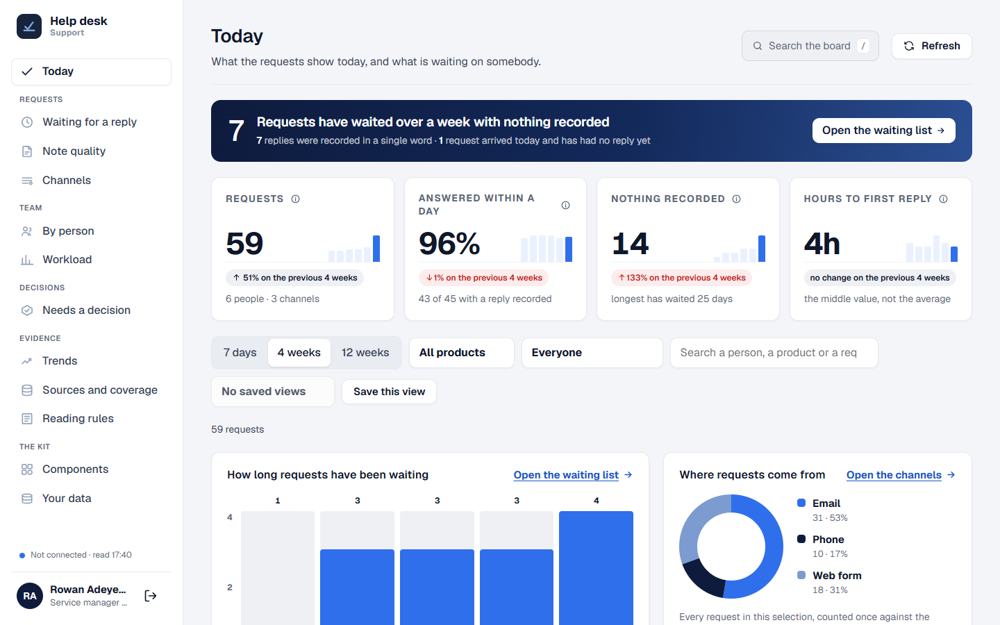
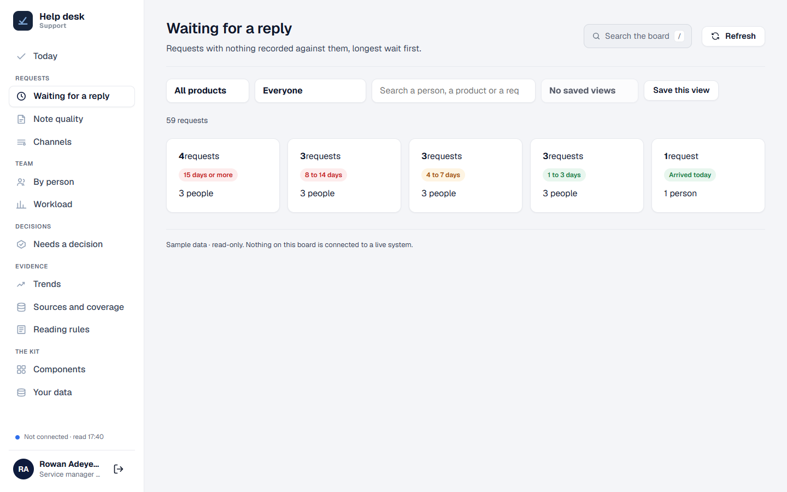
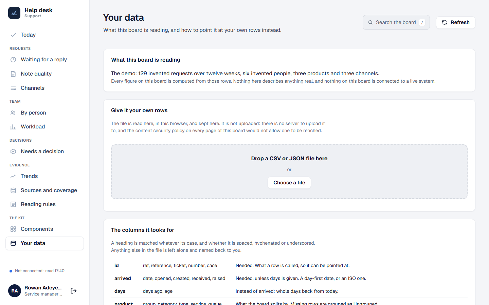
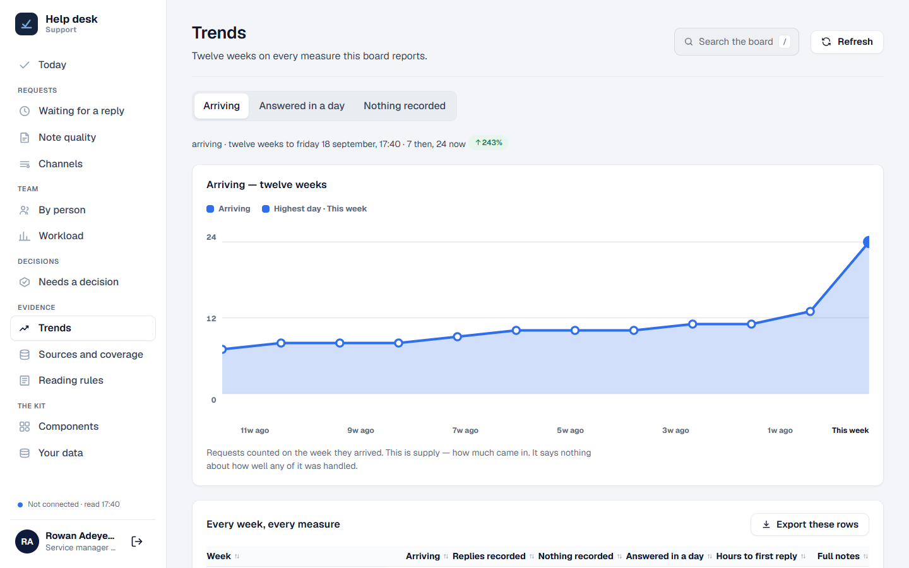

# Plain Board

**A small internal reporting board — the kind of page a team reads on a Monday morning — where every figure says what it does not prove.**

**Live demo:** https://nurah-kamal.github.io/plain-board/ — choose **Look around as a manager**, no account needed.



## What the board shows

Twelve pages, grouped by the question each one answers.

| Page | The question it answers |
| --- | --- |
| **Today** | What needs somebody right now, and how the four headline figures moved against the period before |
| **Waiting for a reply** | Which requests have nothing recorded against them, grouped by how long they have waited |
| **Note quality** | Whether what was written down is enough for the next person to pick the request up |
| **Channels** | Where requests arrive, and how each channel compares with the period before |
| **By person** | What each person was given and what came back on it |
| **Workload** | What is open against each person right now — for balancing, not for judging |
| **Needs a decision** | What is waiting on a manager, grouped by what has to happen next |
| **Trends** | Twelve weeks on every measure the board reports |
| **Sources and coverage** | What the board reads, when it was read, and what it cannot see |
| **Reading rules** | How every figure is counted, and what each one will not prove |
| **Components** | Every chart, control and state the kit ships, drawn once with the call that drew it |
| **Your data** | What the board is reading, and how to point it at your own rows |

## The part worth copying

Most boards overclaim. This one is built not to, and the rules are in the product rather than in a document:

- **A figure says what it does not prove.** Every tile carries an (i) with its counting rule and its limit. A tile without one is not finished.
- **Blank is not proof.** A row with nothing recorded means nobody wrote anything down — not that nothing happened. Every figure that counts blanks says so beside itself.
- **A comparison refuses itself** when there is no honest period behind it, rather than comparing against a shorter, unfair stretch.
- **A percentage is not printed off a base too small to support it.** Two requests becoming eight is not a 300% improvement, it is six requests — so the chip reads `2 to 8`.
- **A change is only coloured where the board can call a direction better or worse.** Volume gets a neutral chip: more arriving is busier, not better.
- **A table caps at 200 rows and names what it capped.** The export still saves everything.
- **Nothing scores or ranks a person.** Note quality is measured on length alone, because length is the only thing the text can honestly be read for.

There is a whole page — **Reading rules** — devoted to what the board will not tell you.



## Your own rows

The demo ships with 129 invented requests. To put your own in front of it, open **Your data** and drop a CSV or JSON file on the page.



- **The file is read in this browser and kept in this browser.** It is not uploaded — there is no server to upload it to, and the content security policy on every page would not allow one to be reached.
- **Two columns are needed, and the page says so before you drop anything:** one that names each row (`id`, `ref`, `ticket`, `number`, `case`) and one that says when it arrived (`arrived`, `date`, `opened`, `created`, `received`, `raised`). Everything else is optional and has a sensible default.
- **Nothing has to be renamed.** Headings are matched however they are spelled, cased, spaced, hyphenated or underscored — `Assigned To`, `Hours to reply`, `Received by` are all understood. Anything the board does not read is left alone and named back to you.
- **There is an example file to start from.** The Your data page will hand you a CSV with the right headings and three rows in it, so you can line your own export up against something real rather than against a table.
- **What it refused is reported as carefully as what it took** — how many lines, and why each one was refused. A refused line is left out of every figure rather than counted as a zero.
- **A board you deploy can carry its own file.** Set `BOARD.dataFile` in `assets/js/shared/board.js` to a CSV sitting beside the board. It must be on the same address: the content security policy allows connections to `'self'` only, which rules out a published sheet or an API unless you widen that policy on purpose.

For anything that is not a file, replace `BoardData.load()` in `assets/js/shared/loading.js` and nothing else changes. Every page already goes through waiting, ready and failed — see them on any page with `?state=loading` or `?state=failed`.

## Your own line on a figure

Every tile carries an (i) explaining what it counts. Inside it, **Watch this figure for me**
draws your own line: above or below a number you choose. When the figure crosses it, the
tile says so — *past your line, above 8 hours* — beside the board's own movement chip.

- **It is a line, not an alert.** Nothing is sent. There is no server to send it, so a
  line shows when you open the board and at no other time. The board says this every
  time you set one rather than letting the word "alert" imply otherwise.
- **The board's rules and yours are kept apart.** The banner says what needs somebody
  according to rules the board was built with. A line is yours. They are never merged,
  so you can always tell which is which.
- **Where the board knows which direction is worth having**, the control opens on that
  side. Where it does not — volume, headcount — it suggests nothing, for the same
  reason the movement chip stays neutral on those figures.
- **A figure the board could not read is never past a line.** A dash is not a number.

Lines live in that browser, like saved views.

## Saved views

A selection worth coming back to can be named and kept: the picker at the end of the filter bar, and one button that says either **Save this view** or **Remove this view**, depending on whether what is on screen is already saved.

- **A saved view lives in that browser.** It is not shared, synced or backed up.
- **To send somebody a view, send them the page link.** The filters are in the address bar already, which is the part that does travel.



## How it is built

No framework. No build step. No dependencies. No chart library. Every chart on those pages is drawn in SVG by one file, with no library behind it.

| | |
| --- | --- |
| **The shell** | Left menu, phone bottom bar, page header, board-wide search, sign-out, toast, footer |
| **Charts** | Ring, donut, area with a key and a pointer reading, paired bars, bar list, column chart, sparkline |
| **Tables** | Row ticking with export of only the ticked rows, click-to-sort, and cells that carry their own heading on a phone |
| **Controls** | Segmented period picker, filter bar, saved views, drill-down tiles with the step kept in the address bar |
| **States** | Waiting, ready and failed, all three drawn — plus a printed form for when the board goes into a meeting |
| **Tooling** | One script to rename the board, one to build every page from a single shell, one to version assets before a commit |

Every one of these is drawn on the **Components** page with the call that drew it underneath. That is the fastest way to see what is in the box.

## Try it on your own machine

Nothing to install. Open a terminal in the folder and run any static server, for example:

```bash
npx serve .
```

Then open the address it prints.

## Making it your own

**Start with the name.** It lives in five places, and a copy that is called two things reads as a copy:

```bash
node tools/new-board.js "Intake board" --team "Admissions"
```

That renames the board, the small word under it in the menu, the page titles and the prefix it remembers choices under, then rebuilds every page.

Then four files, in this order:

**1. `assets/js/shared/data.js`** — the demo rows, and the helpers that read them. Replace them, or leave them and load a file on **Your data** instead.

**2. `assets/js/shared/board.js`** — the board's name, its home page, the footer line, what the phone tab bar holds, and one search function. The shell reads this and follows it.

**3. `tools/build-pages.js`** — the page list, the menu, and the markup of each page. Add a page here rather than writing a new HTML file by hand, then run:

```bash
node tools/build-pages.js
```

**4. `assets/js/pages/*.js`** — one script per page, which fills the markup in. Start from the demo's and work backwards.

Before every commit that touches anything in `assets/`:

```bash
node tools/stamp-assets.js
```

This appends a content hash to every asset link. GitHub Pages lets a browser keep a stylesheet or a script for ten minutes; without this step a visitor can load your new markup beside your old script, and a control that is on screen does nothing. It is the least obvious bug in the whole kit, so the tool exists to make it impossible.

## Things worth knowing

**Every script shares one scope.** There is no module system, so two files declaring the same `const` will silently kill a page. Keep names distinct across `shared/` and `pages/`.

**There is a content security policy on every page.** No inline scripts, and styles are set through the element from JavaScript rather than injected as text. It is why there is no chart library: nothing external loads except the two fonts.

**The demo sign-in is a demonstration.** It remembers a sample person in `localStorage` and nothing more. Replace `assets/js/shared/session.js` when you connect real accounts, and do not treat the manager/member split as a security boundary — it decides what is drawn, not what is allowed.

**Roles are drawn, not hidden.** A team member's person filter is set to their own name and locked rather than removed, and a manager-only page stays in their menu labelled **Managers** rather than vanishing. Showing the rule reads better than quietly leaving a control out.

**A figure formatted for reading does not sort the way it reads.** `1d` is longer than `20h` but sorts before it on text, so a formatted cell carries its raw value: `numberCell('1d', 26)`.

**One theme, deliberately.** Light, from the Service Board design system. These boards are read at a desk and on a projector, so there is no dark mode to maintain.

## Folders

```
index.html               sign in
pages/                   the signed-in pages, all generated
assets/css/styles.css    the whole design
assets/js/shared/        source.js (your rows), data.js (the demo), board.js, app.js (the shell),
                         charts.js, filters.js, views.js, loading.js, session.js, auth.js
assets/js/pages/         one script per page
assets/img/              the logo and the screenshots above
tools/new-board.js       renames the board everywhere it is named
tools/build-pages.js     builds every page from one shell
tools/stamp-assets.js    versions every asset link before a commit
```

## The design

Written down in [DESIGN.md](DESIGN.md): the colour tokens, the two typefaces, the three corner radii, and the rules about what a chart may and may not say.

## Licence

MIT. Use it for anything, including at work.
